# Nazumi / StreamHub — Feature Reference

A working notebook for revision and interviews. Each feature is written the same
way:

- **What it is** — one line.
- **User flow** — what someone clicks, and what comes back.
- **How it works** — the mechanism, with a diagram.
- **First principles** — *why* it is built this way, what the alternatives were,
  and what breaks if you choose differently. This is the part worth rehearsing;
  the rest is recall.

> Diagrams are Mermaid. They render on GitHub, in VS Code with a Mermaid
> extension, and in most Markdown viewers. Sequence diagrams are the ones to
> study: they show *click → reaction*, which is what an interviewer is probing.

---

## Contents

1. [The shape of the system](#1-the-shape-of-the-system)
2. [Authentication](#2-authentication)
3. [Video upload and transcoding](#3-video-upload-and-transcoding)
4. [Adaptive playback (HLS)](#4-adaptive-playback-hls)
5. [Thumbnails](#5-thumbnails)
6. [Captions](#6-captions)
7. [Engagement: likes, comments, subscriptions](#7-engagement-likes-comments-subscriptions)
8. [Discovery: search, categories, related](#8-discovery-search-categories-related)
9. [Notifications](#9-notifications)
10. [Channel identity](#10-channel-identity)
11. [Rate limiting](#11-rate-limiting)
12. [Moderation and takedown](#12-moderation-and-takedown)
13. [Live streaming](#13-live-streaming)
14. [Live chat](#14-live-chat)
15. [Testing strategy](#15-testing-strategy)
16. [Cross-cutting lessons](#16-cross-cutting-lessons)

---

## 1. The shape of the system

Five processes. Knowing why there are five — rather than one — is the first
architectural question anyone will ask.

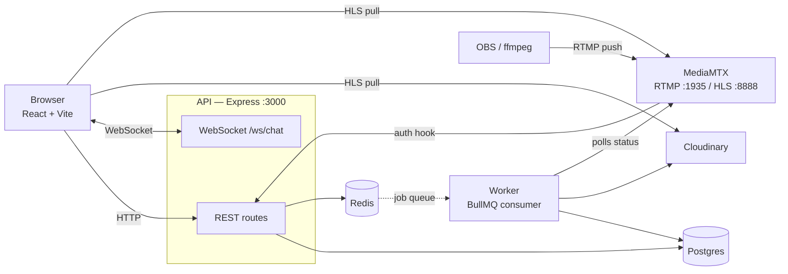

**Why five processes and not one**

| Process | Why it cannot live in the API |
| --- | --- |
| Worker | Transcoding takes minutes and pins a CPU. Inside the request handler it would block the event loop and exceed any HTTP timeout. |
| MediaMTX | Express speaks HTTP. RTMP is a different protocol on a different port; Node cannot accept it without an entirely separate implementation. |
| Postgres | Durability. Obvious, but say it. |
| Redis | Two jobs: the queue (BullMQ) and rate-limit counters that must survive restarts and be shared across API instances. |

**The single most important idea:** *slow work does not belong in a request.*
The upload endpoint returns `202 Accepted` in milliseconds and hands a job to a
queue. Everything else about the pipeline follows from that one decision.

---

## 2. Authentication

**What it is.** Google sign-in via better-auth, with an http-only session
cookie.

### User flow

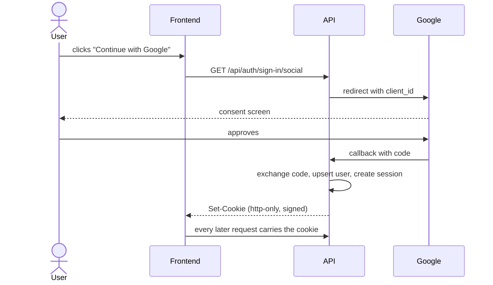

### First principles

- **Why a cookie and not a JWT in localStorage?** `localStorage` is readable by
  any script on the page, so one XSS leaks the token permanently. An http-only
  cookie is not reachable from JavaScript. The cost is CSRF exposure, which
  `SameSite` plus an origin allow-list handles.
- **Why is the cookie signed?** The value is a session id. Signing stops a
  client forging one. The signature is `HMAC-SHA256(token, secret)`.
- **The secret matters enormously.** With `BETTER_AUTH_SECRET` unset,
  better-auth falls back to a constant published in its own npm package —
  meaning anyone can mint a valid session for any user. This was a real finding
  in this project before it was fixed.
- **`currentUser()` is memoised per request.** Rate limiting, a route guard and
  the controller each ask "who is calling?", and each lookup is a database round
  trip. The resolved promise is cached on the request object under a `Symbol`.

---

## 3. Video upload and transcoding

**What it is.** Upload a file; it is transcoded into an adaptive HLS ladder in
the background and becomes publishable when ready.

### User flow

1. Pick a file → client checks type and size *before* uploading.
2. Fill in title, description, category, tags, optional thumbnail.
3. Upload with a progress bar (XHR, not `fetch` — see below).
4. Server replies `202` immediately; the dialog polls status.
5. Worker transcodes; a notification says "ready to publish".
6. Creator publishes it.

### How it works

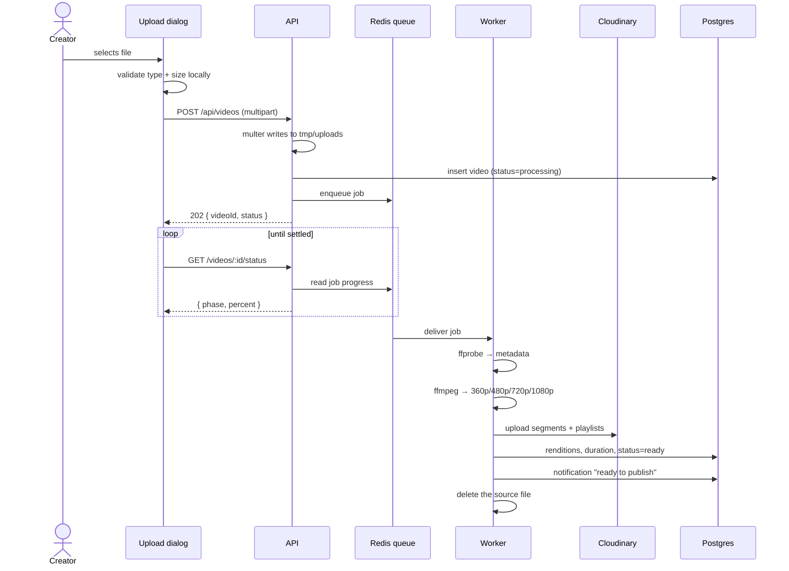

### First principles

- **Why a queue instead of transcoding in the request?** A 10-minute video takes
  minutes to transcode. HTTP connections time out; load balancers kill idle
  requests; a crash mid-request loses everything. A queue gives you retries,
  backpressure, progress reporting and crash recovery for free.
- **Why XHR for the upload and `fetch` everywhere else?** `fetch` still cannot
  report *upload* progress. A multi-hundred-megabyte upload without a progress
  bar feels broken. That single limitation is why `IUploadClient` exists as a
  separate interface from `IHttpClient`.
- **Why validate on the client when the server validates anyway?** To avoid
  sending 500 MB before being told no. The server check is the real one; the
  client check is a courtesy.
- **Why is the thumbnail a form *field* and not a file?** It arrives as a base64
  data URL. This caused a real bug: multer's `fieldSize` defaults to **1 MB**,
  base64 inflates by 4/3, so any image over ~750 KB killed the entire upload
  with an HTML 500. Fixed by raising `fieldSize` and adding a JSON error
  handler.
- **Why delete the source only on success?** A failed job needs its source for
  the retry. The `failed` handler deletes it once attempts are exhausted. Before
  this was fixed, every successful upload leaked its source forever.
- **Retries are exponential (3 attempts, 30s backoff)** — right for a transient
  Cloudinary blip, wrong for a corrupt file, which burns ~90 seconds before
  reporting failure.

---

## 4. Adaptive playback (HLS)

**What it is.** One upload becomes several quality rungs; the player picks based
on bandwidth and switches mid-playback.

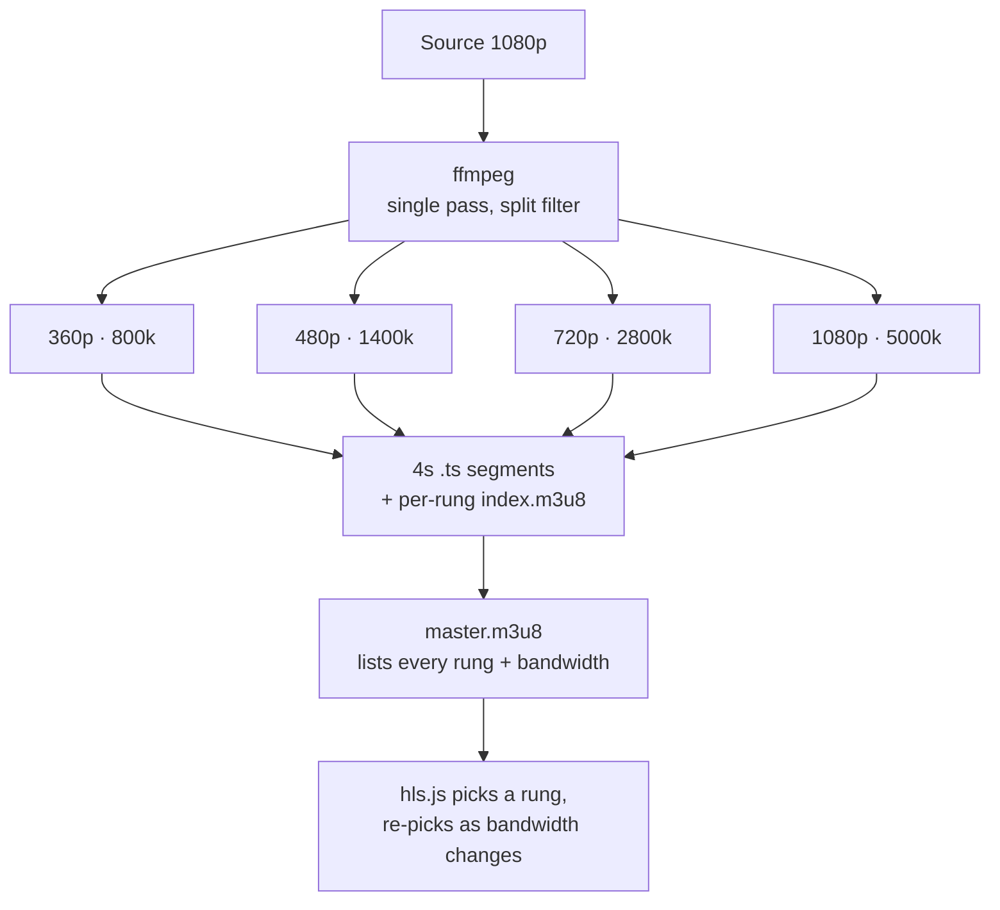

### First principles

- **Why HLS and not a plain MP4?** A single MP4 forces one quality on everyone:
  buffering on mobile, or wasted bandwidth and poor quality on fibre. HLS splits
  the video into small segments at several bitrates so the client can switch
  *between segments*. It is also plain HTTP, so any CDN caches it.
- **Why 4-second segments?** Trade-off. Shorter means faster quality switching
  and lower latency, but more requests and more overhead. 2–6s is the usual
  range; 4s is the common default.
- **Why one ffmpeg pass with a `split` filter?** Decoding is the expensive part.
  Decode once, scale to four outputs, encode four times — far cheaper than
  running ffmpeg four times.
- **Why does the ladder stop at the source height?** `selectRungs` never
  upscales. Encoding a 480p source to 1080p costs CPU and bytes to produce a
  blurrier picture.
- **A real Windows trap:** ffmpeg writes `360p\index.m3u8` — with a backslash —
  into the master playlist. The upload step normalises `\` to `/` before
  rewriting URLs. Without it, every upload on Windows fails with "playlist
  references something that was never uploaded".

---

## 5. Thumbnails

**What it is.** Three poster frames are extracted during transcode; the first
becomes the thumbnail if the creator supplied none.

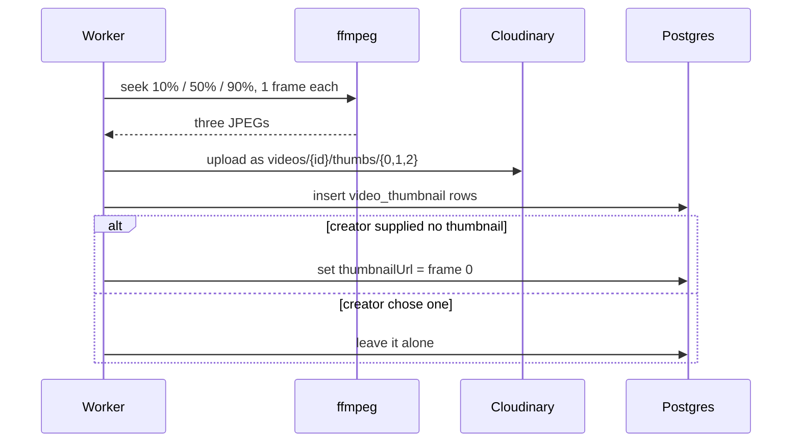

### First principles

- **Why seek *before* `-i` and not after?** `-ss` before the input seeks to the
  nearest keyframe without decoding; after the input, ffmpeg decodes from the
  start. For three frames out of a long video the difference is enormous.
- **Why never overwrite a creator's choice?** Their intent outranks a heuristic.
- **Why can a creator only pick from *their own* video's candidates?** The PATCH
  endpoint validates the URL against stored rows for that video. Otherwise any
  URL on the internet could be planted as a thumbnail.
- **Why does deselecting a frame not delete it?** Generated frames stay
  available for reselection. Only a creator's own *uploaded* image is destroyed
  when replaced — distinguished by its Cloudinary path prefix.

---

## 6. Captions

**What it is.** Subtitle tracks already embedded in an upload are extracted to
WebVTT; tracks can also be uploaded.

### First principles

- **Why convert to WebVTT?** It is the only format a browser `<track>` reads.
  SRT and `mov_text` have to be converted.
- **Why skip bitmap subtitles (PGS, DVD)?** They are *pictures of text*. There
  is nothing to convert without running OCR.
- **Why store the VTT in Postgres rather than object storage?** Two reasons. A
  `<track>` is only honoured when served as `text/vtt`, and object storage
  guesses content types for unusual extensions. And serving it from your own
  origin avoids the cross-origin fetch the player would otherwise make. Even a
  feature-length transcript is well under a megabyte of text.
- **The caption file endpoint is a capability URL** — knowing the id is the
  permission. It *cannot* check who is asking, because a `<track>` fetches with
  `crossorigin="anonymous"` and never sends cookies; a creator previewing their
  own draft would see no subtitles. The alternative, `use-credentials`, breaks
  the poster image, because Cloudinary answers `Access-Control-Allow-Origin: *`
  and browsers reject that on credentialed requests. What protects a draft is
  that ids are uuidv7 and the *list* endpoint is scoped.

---

## 7. Engagement: likes, comments, subscriptions

### Click → reaction

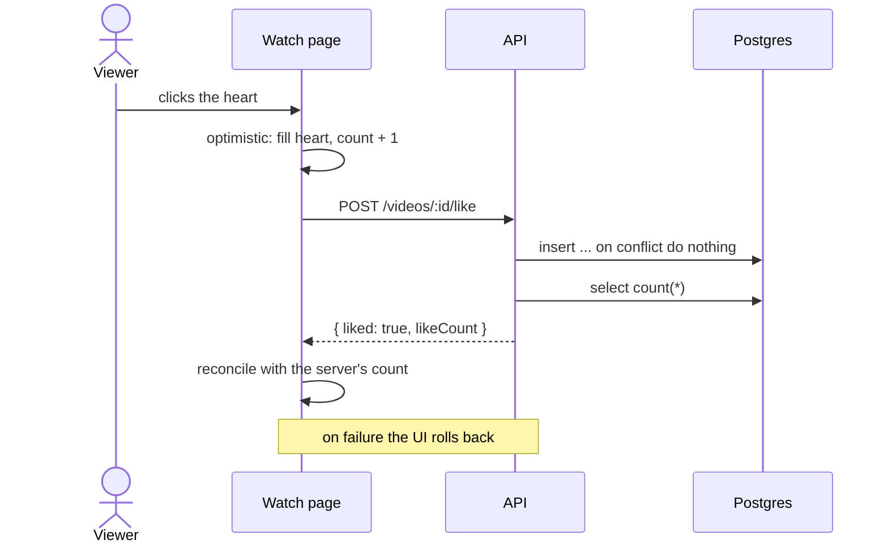

### First principles

- **Why `ON CONFLICT DO NOTHING` and a unique index, rather than "check then
  insert"?** Two rapid clicks produce two requests. Both read "not liked", both
  insert, and you have two rows and a count of 2. The database constraint is the
  only race-free answer. *This is the classic interview point.*
- **Why is optimistic UI safe here?** Precisely *because* the endpoints are
  idempotent. Fire immediately, reconcile with the returned count, roll back on
  error.
- **Why are comment threads only one level deep?** Replying to a reply re-parents
  onto the thread root. Arbitrary nesting needs a recursive renderer, produces
  unreadable staircases on mobile, and makes pagination very hard. One level is
  what YouTube, Instagram and Hacker News-style products converge on.
- **Why does a reply notify only the parent author, not also the video owner?**
  Exactly one person is notified per comment, so a reply on your own video
  arrives once rather than twice.
- **Why does the feed use a cursor and not `OFFSET`?** With offset pagination, a
  new video inserted while you are reading shifts everything and page 2 repeats
  a row from page 1. A cursor (`WHERE id < :cursor`) is stable under inserts.
- **Why does the cursor work at all?** Ids are **uuidv7**, which is
  time-ordered. Sorting by id *is* sorting by creation time, so one indexed
  column serves as both sort key and cursor.

---

## 8. Discovery: search, categories, related

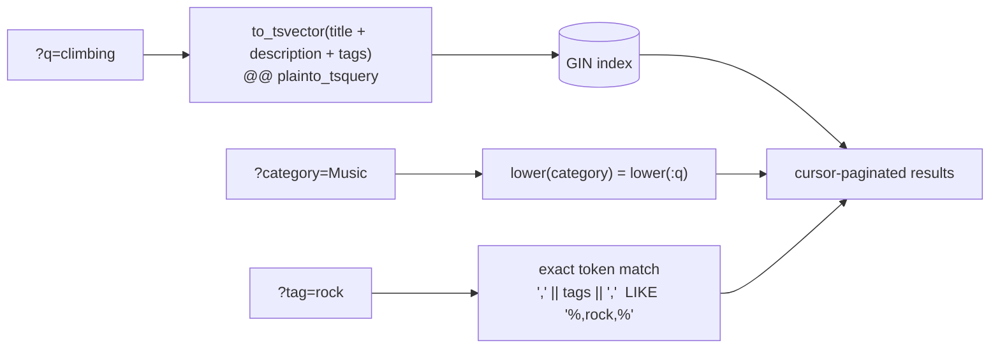

### First principles

- **Why Postgres full-text and not `LIKE '%term%'`?** Full-text stems, so
  "climbing" finds "rock climb". `LIKE` cannot, and cannot use an index for a
  leading wildcard.
- **Why is tag matching token-based?** A naive `LIKE '%rock%'` matches a video
  tagged `rocket`. The query wraps both sides in commas so only a whole entry
  matches. This looks fine with four videos and becomes embarrassing with four
  hundred.
- **Why does the GIN index have to mirror the query expression exactly?** A
  functional index is only used when the expression matches character for
  character. Change one in the controller and Postgres silently falls back to a
  sequential scan — no error, just slow.
- **Why top up "related" with recent videos?** An empty rail is worse than a
  loosely related one. Matches come first, fillers after.

---

## 9. Notifications

**What it is.** A bell with an unread badge, driven by polling.

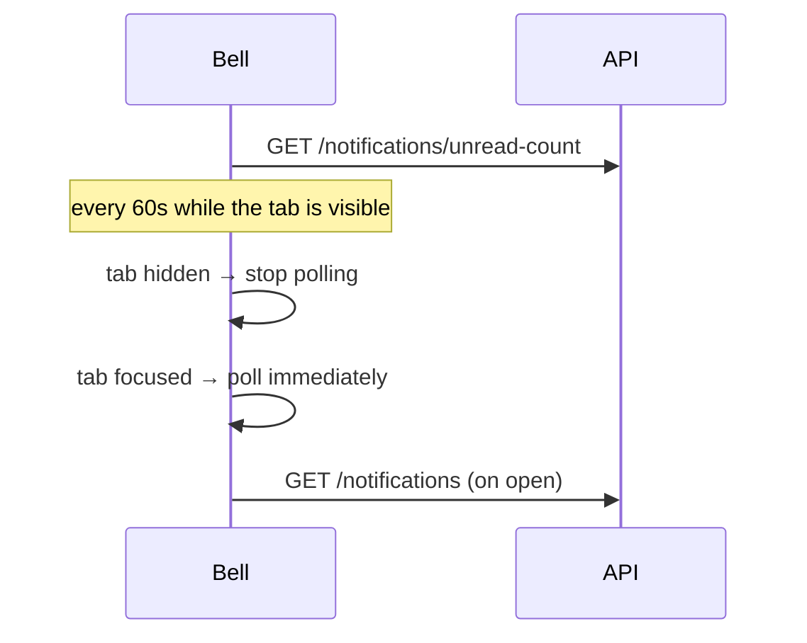

### First principles

- **Why polling and not WebSockets?** Nobody is *waiting* on "someone uploaded a
  video". 60 seconds of latency costs nothing perceptually, and it is one
  indexed count per poll. A persistent connection per signed-in user is real
  infrastructure — justified by chat, not by a badge.
- **Why pause while hidden and refresh on focus?** An interval alone is both
  wasteful *and* stale: it burns requests behind a hidden tab, and leaves the
  badge up to a minute old at the exact moment someone looks at it. Refreshing
  on focus removes nearly all the perceived staleness.
- **When *should* it become push?** When a real-time transport already exists
  for another reason — which it now does, for chat.
- **Why does publishing set `publishedAt` once?** Subscribers are notified only
  the first time a video goes public. Without it, unpublishing and republishing
  would ping everyone again about something they have already seen.

---

## 10. Channel identity

**What it is.** A creator can set a channel name, bio and picture, separate from
their Google account.

### First principles

- **Why new columns instead of overwriting `user.name` and `user.image`?**
  better-auth owns that table. If a later sign-in refreshes the profile from
  Google, it overwrites *its own* fields — and cannot touch
  `display_name` / `avatar_url`. Separation makes the clash impossible rather
  than unlikely.
- **Why resolve the display name in JS rather than a SQL `coalesce`?** See
  [§16](#16-cross-cutting-lessons) — drizzle renders unqualified columns inside
  `select()`, so a coalesce over a joined `name` binds to whichever table the
  planner picks.
- **Why does a freshly posted comment need the resolved name?** The create
  endpoint echoes the comment back and was building the author from the session,
  which carries the *account* name. The author's name would change under them on
  refresh.

---

## 11. Rate limiting

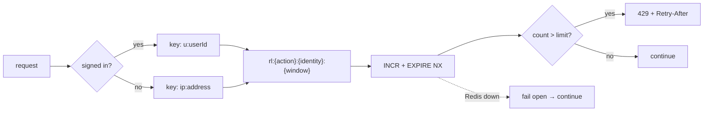

### First principles

- **Why Redis and not in-process memory?** An in-memory counter resets on every
  deploy and multiplies by the number of instances — it fails exactly when it
  matters most.
- **Why a fixed window rather than a sliding log?** One `INCR` per request. The
  worst case is a caller getting 2× the limit across a window boundary, which is
  perfectly acceptable for stopping comment spam.
- **Why fail open?** A limiter that takes the site down when Redis blinks is
  worse than the abuse it prevents. Availability beats enforcement here —
  though note that for a *login* endpoint you might well argue the opposite.
- **Why separate buckets per action?** Running out of comments must not stop you
  liking a video.
- **Why key signed-in users by account, not IP?** An office or household behind
  one address would otherwise share a budget.

---

## 12. Moderation and takedown

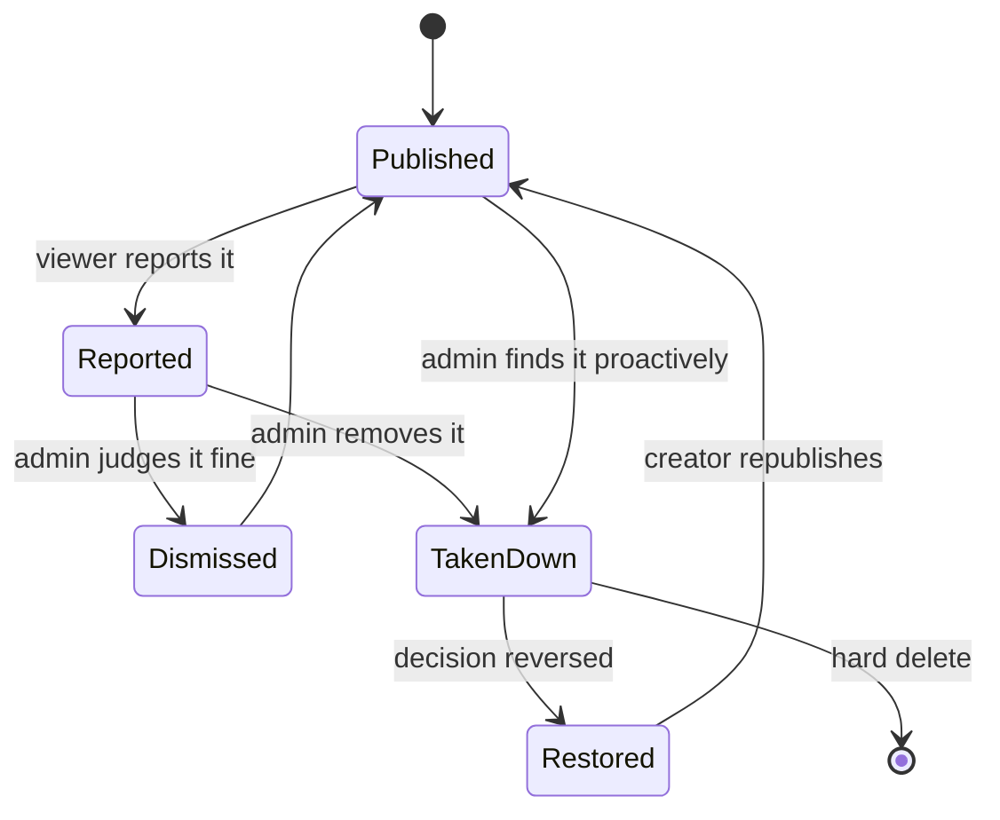

### First principles

- **Why takedown *and* delete?** Deletion destroys the creator's work with no
  record and no recourse if the call was wrong. A takedown unpublishes with a
  stated reason, keeps the evidence, and is reversible. Hard delete stays for
  content that must not merely be hidden.
- **Why is a reason mandatory?** A video that silently disappears reads as a
  bug. The creator would simply try publishing it again.
- **Why block republishing after a takedown?** Otherwise a takedown is a
  one-click inconvenience.
- **Why does restoring *not* republish?** Whether it goes back up is the
  creator's call, not the moderator's.
- **Why does the takedown notification name no admin?** A moderation decision
  speaks for the platform. Naming the person invites retaliation.
- **Why can a creator moderate comments but not reports about their own video?**
  Judging a complaint about your own work is not a neutral act. Comments on your
  video you already control; the video itself is an admin decision.
- **The honest limitation:** this is entirely *reactive*. Content is publicly
  visible between upload and the moment someone reports it. Automated screening
  would close that gap.

---

## 13. Live streaming

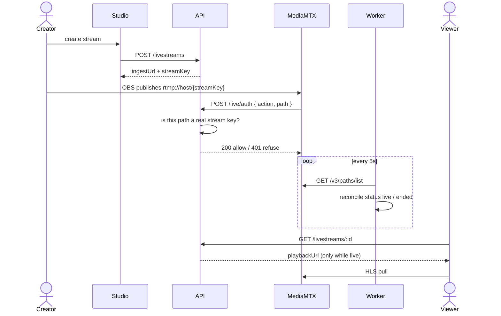

### First principles

- **Why a separate media server?** Express speaks HTTP. RTMP is a different
  protocol — a persistent TCP stream of FLV tags on port 1935. MediaMTX accepts
  it and republishes as HLS, which the existing player already handles.
- **Why is the stream key the RTMP path?** OBS sends the key as the publish
  path, so MediaMTX's auth hook receives it directly and the API can match it
  against a row. The key is a bearer credential, never exposed to viewers, and
  rotatable.
- **Why rotate-while-live is refused:** it would cut the broadcast mid-stream.
- **Why poll the control API instead of trusting the auth hook?** The hook fires
  when a publish *starts* and says nothing about it ending. A broadcaster can
  drop off at any moment without telling anyone — the server's own view is the
  only truth.
- **Why does an unreachable MediaMTX leave statuses alone?** "Cannot read" is
  not "nothing is live". Marking everything ended on a network blip would knock
  real broadcasts off the air.
- **Why is the playback URL withheld unless live?** Offline it points at a
  playlist that 404s, and the player would sit on a dead URL.

### Latency, and why LL-HLS

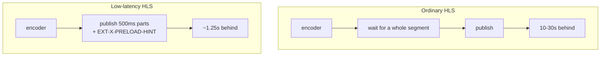

- **Why did it matter here?** Chat is instant. With 10–30s video delay, people
  react to moments other viewers have not reached yet.
- **Mechanism:** ordinary HLS only publishes a segment once complete. LL-HLS
  publishes *partial* segments as they are produced and advertises a preload
  hint so the client can request the next part before it exists. `PART-HOLD-BACK`
  in the playlist is the spec's minimum latency — measured at **1.25s** here.
- **The client half is not optional.** Without `lowLatencyMode: true`, hls.js
  ignores the parts entirely and you fall straight back to segment-at-a-time
  latency, with the server doing extra work for nothing.
- **DVR:** `streamType="ll-live:dvr"` makes the timeline seekable. The rewind
  window is bounded by how many segments the server still holds — a 10-second
  skip-back needs the server configured for comfortably more than 10 seconds.

---

## 14. Live chat

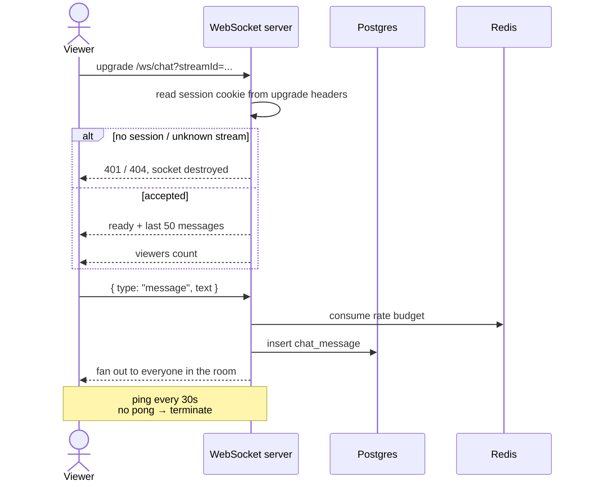

### First principles

- **Why WebSockets here and polling for notifications?** Requirements differ.
  Chat is a conversation — a minute of delay makes it unusable. A badge is not.
  Build the expensive transport where it is actually required.
- **Why share the API's port and origin?** So the browser sends the session
  cookie on the upgrade request. A WebSocket on another origin would not get it.
- **Why `noServer: true`?** The upgrade can be refused *before* a socket exists,
  rather than accepting everyone and disconnecting them a moment later.
- **Why a heartbeat?** A browser that sleeps or loses network leaves a socket
  that looks open forever. Ping/pong is the only way to notice — otherwise
  viewer counts drift permanently upward.
- **Why does auto-scroll only follow when you are already at the bottom?**
  Yanking someone back down while they read older messages is worse than missing
  a line.
- **The scaling limit, stated honestly:** rooms live in one process's memory. A
  second API instance would split viewers into separate rooms. Crossing that
  needs Redis pub/sub — worth adding the day a second instance exists, not
  before.

---

## 15. Testing strategy

**205 backend tests, 37 frontend.** The shape is worth explaining.

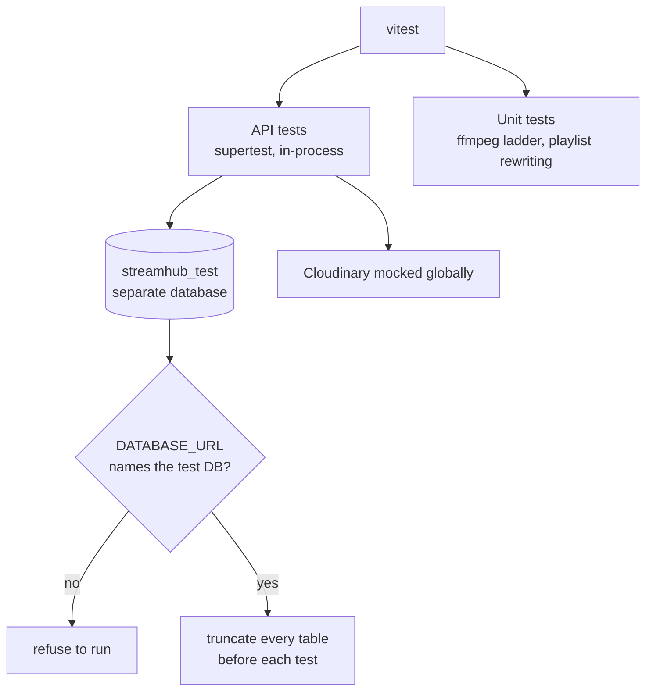

### First principles

- **Why drive the HTTP API rather than call controllers directly?** The
  middleware chain *is* part of the behaviour. The upload guards live in multer,
  not the controller — calling the controller would test nothing that matters.
- **Why a real database and not mocks?** Most of the interesting logic is SQL:
  cascades, unique constraints, full-text matching. Mocking the database would
  mock away the thing under test.
- **Why the `DATABASE_URL` guard?** The suite truncates every table before each
  test. One misconfigured env file would wipe development data. The guard makes
  that impossible rather than unlikely.
- **Why mock Cloudinary but not Postgres?** It is a paid, shared, external
  service, and the delete path would issue real requests.
- **A test that cannot fail is worthless.** After writing the suite, a regression
  was deliberately injected — tag matching reverted to substring — to confirm the
  right test went red with the right message.

---

## 16. Cross-cutting lessons

These are the ones worth telling a story about, because each was a real bug.

### Drizzle renders unqualified columns inside `select()`

Hit **three times**. A correlated subquery written as:

```ts
sql`(select count(*) from ${like} where ${like.videoId} = ${video.id})`
```

renders as:

```sql
(select count(*) from "like" where "video_id" = "id")
```

Inside that subquery `"id"` binds to **`like.id`**, not `video.id`. Consequences
varied by luck:

| Where | Symptom |
| --- | --- |
| Like/comment counts | Silently always zero — no error at all |
| Admin user listing | Hard failure: `text = uuid` operator does not exist |

**Fix:** grouped subqueries joined once (`lib/listing.ts`), which is also one
join instead of N correlated subqueries. **Lesson:** a bug that fails loudly is a
gift; the same bug failing silently shipped.

### `position: fixed` is not always relative to the viewport

A modal centred itself in the content column instead of the screen. Cause: any
ancestor with a `transform` becomes the containing block for fixed descendants —
and `animate-fadeIn` ends on `transform: translateY(0)` with `forwards`, leaving
a permanent transform that visually does nothing.

**Fix:** render modals through a portal to `document.body`, which removes the
whole class of bug.

### Reserved words

`user` and `like` are both reserved in Postgres. Quoting only the ones you
remember invites the next one to be forgotten — quote them all.

### Fail open vs fail closed

Rate limiting fails **open** (Redis down → allow). The live monitor fails
**closed** in the sense of changing nothing (MediaMTX unreachable → leave
statuses alone). Both are "do no harm", but the reasoning differs: one protects
availability, the other protects live broadcasts from a false negative.

### Idempotency beats checking

Likes, subscriptions and reports all use `ON CONFLICT DO NOTHING` over a unique
index. No read-then-write, no race, and the UI can be optimistic for free.

---

## Quick revision card

| Question | One-line answer |
| --- | --- |
| Why a queue? | Transcoding takes minutes; a request cannot wait. |
| Why HLS? | Adaptive bitrate over plain cacheable HTTP. |
| Why XHR for upload? | `fetch` cannot report upload progress. |
| Why cursor pagination? | Stable under inserts; offset repeats rows. |
| Why uuidv7? | Time-ordered, so the id is also the cursor. |
| Why unique index not check-then-insert? | Two clicks race; the database is the only arbiter. |
| Why polling for notifications? | Latency is free there; a connection per user is not. |
| Why WebSockets for chat? | A conversation cannot tolerate a minute of delay. |
| Why a separate media server? | Express speaks HTTP; RTMP is another protocol. |
| Why LL-HLS? | Publish partial segments: 10–30s → ~1.25s. |
| Why takedown over delete? | Reversible, explains itself, keeps evidence. |
| Why fail open on rate limits? | Downtime is worse than the abuse it prevents. |
